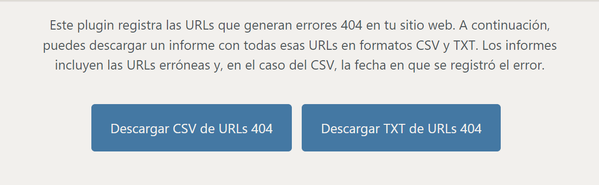

# 404 TrackMaster

**Contributors**: [Javier Blanco](https://javierblanco.tech/)

**Tags**: 404, errors, tracking, csv, txt, urls, redirect, report

**Requires at least**: 4.0

**Tested up to**: 5.8

**Requires PHP**: 5.6

**Stable tag**: 1.5

**License**: [GPLv2 or later](https://www.gnu.org/licenses/gpl-2.0.html)

Registra las URLs que generan errores 404 y permite descargarlas en formatos CSV y TXT con filtrado por fechas.

## Description

404 TrackMaster es un plugin esencial para aquellos administradores de sitios web que desean mantener un registro y seguimiento de las URLs que generan errores 404. 

**Características principales**:

- **Registro automático de URLs 404**: Cada vez que un usuario intenta acceder a una URL no existente, el plugin lo registra automáticamente.
- **Exportación en CSV y TXT**: Los administradores pueden exportar fácilmente la lista de URLs que generan errores 404 en formatos CSV y TXT. El formato CSV también incluye la fecha en que se detectó el error.
- **Fácil acceso desde el panel de administración**: Una vez instalado el plugin, encontrarás una opción en el menú de administración para acceder a las funcionalidades del plugin.

## Installation

1. Sube los archivos del plugin al directorio `/wp-content/plugins/404-trackmaster`, o instala el plugin directamente a través de la pantalla de plugins de WordPress.
2. Activa el plugin desde la pantalla 'Plugins' en WordPress.
3. Una vez activado, encontrarás una opción en el menú de administración llamada '404 TrackMaster' donde podrás descargar los informes.

## Frequently Asked Questions

**¿Hay algún límite en la cantidad de URLs 404 que puedo registrar?**

No, el plugin registrará todas las URLs 404 mientras haya espacio en la base de datos de tu sitio web.

**¿Puedo filtrar las URLs por fecha?**

Actualmente, el plugin ofrece la descarga de todas las URLs 404 registradas. Sin embargo, el formato CSV incluye fechas, lo que permite filtrar las URLs después de descargarlas.

## Screenshots

## Changelog

### 1.5
- Mejoras en la interfaz de usuario y diseño de la página de administración.
- Optimización del código y corrección de errores menores.

## Upgrade Notice

### 1.5
Actualización recomendada para todos los usuarios para mejorar la experiencia del usuario y la estabilidad del plugin.

---

**Conéctate con el desarrollador**:

- [Portafolio - Javier Blanco](https://javierblanco.tech/)
- [LinkedIn](https://www.linkedin.com/in/javierblancotech)
